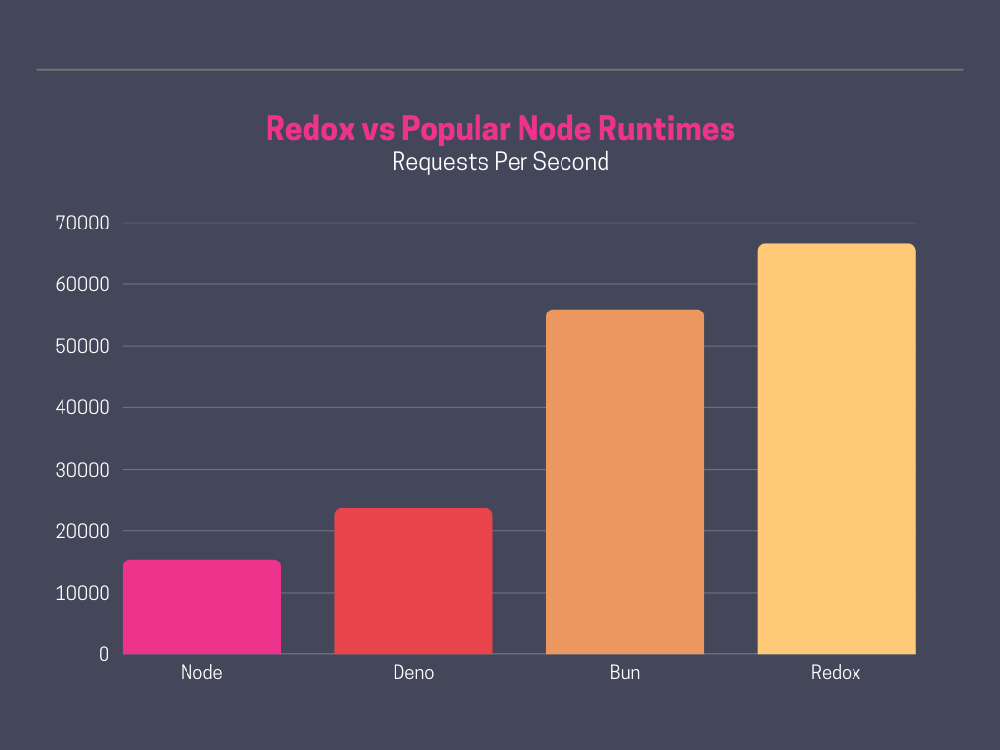
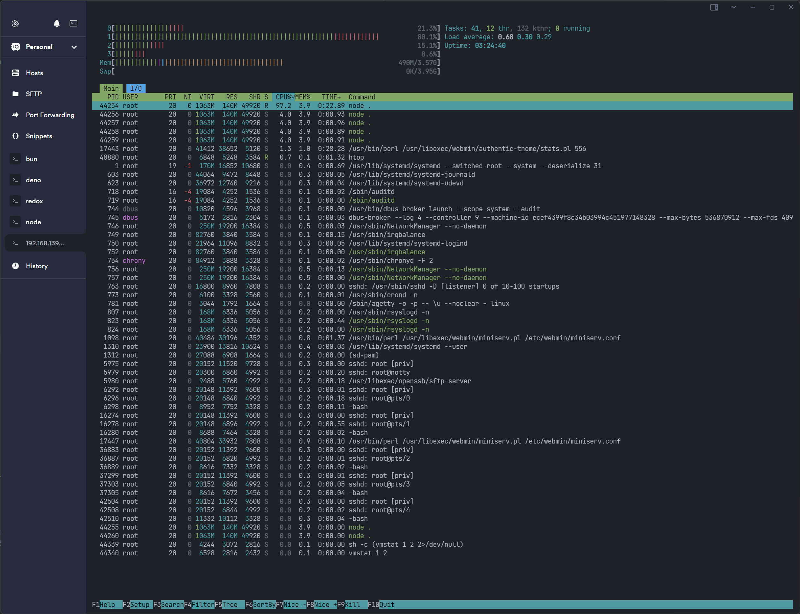
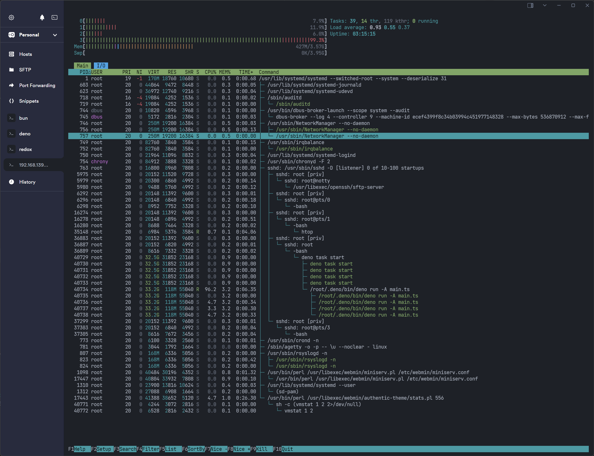
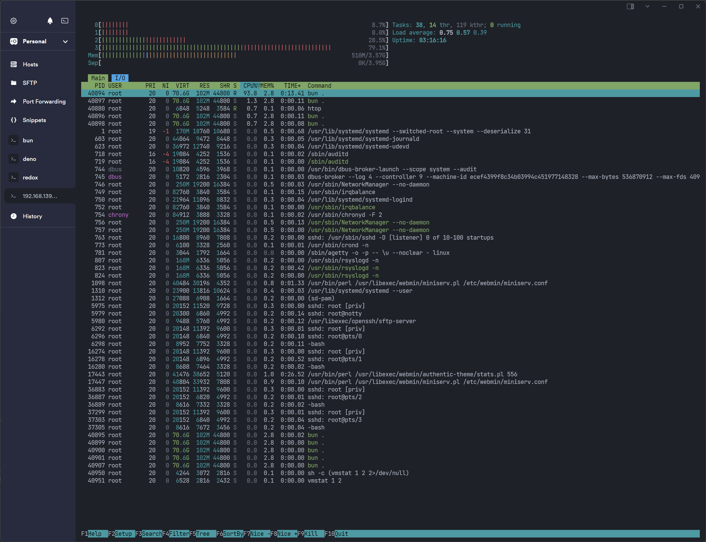
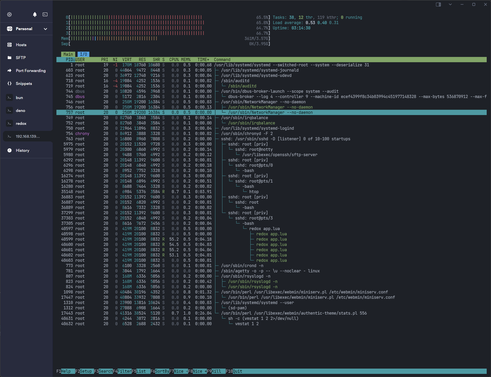

# Introduction

This high-level synthetic benchmark is designed to compare the performance and resource utilization of the new wave of JavaScript runtimes.

The benchmark uses a simple route:

```javascript
app.get("/", (req, res) => {
    res.json({
        id: 1,
        name: "Alice",
        uuid: crypto.randomUUID()
    });
});
```

This example leverages **Express**, which is known for its poor performance in synthetic benchmarks. However, this choice is deliberate and serves an important point.

With the new runtimes boasting significant performance improvements while maintaining Node compatibility, we must ask: Will users adopt a performance-first mindset when publishing and using libraries? Or will convenience remain the priority?

It’s fair to argue that with careful tuning and selective library choices, the JavaScript ecosystem can be optimized for performance. But that’s not the point. As developers, we often prioritize convenience and time-to-market over performance. Redox aims to challenge this tradeoff by showing that performance and convenience can coexist.

Redox takes a different approach, moving away from NPM and Node libraries. Instead, it exposes high-performance Rust libraries via simple Lua interfaces, delivering compounded performance benefits.

This will naturally not cater for all use cases but the 80/20 rule applies again here. For the majority of use cases, Redox can provide a significant performance boost without sacrificing convenience by interfacing the popular 20% which are used for 80% of the time.

With Redox, you’re not just getting great performance at the boundary; you’re also ensuring efficiency across every API you use.

> Before diving into the numbers, let’s set the stage. Modern JavaScript runtimes are phenomenal, benefiting from years of development, massive communities, and significant funding. They excel in scenarios where the bulk of your application is built around a scripting language, and in those cases, they’re undoubtedly the best choice.
> 
> However, if your application primarily involves integrating popular databases, caches, and APIs, you might be pleasantly surprised by the performance gains and simplicity Redox offers.
> 
> Architecture plays a crucial role too. For example, if your setup involves a 16GB RAM box caching significant amounts of edge data, scripting runtimes like Python or JavaScript may fall short, forcing you to make architectural compromises based on your tools. Redox, by contrast, was designed to accommodate diverse architectural needs without those constraints.
> 
> Now, you might be thinking, “Why not just use Java, .NET, Go, etc.?” And that’s a valid point—but let’s explore whether there’s another way forward.



## Node




## Deno




## Bun




## Redox




## Summary

The metrics clearly demonstrate that Redox performs exceptionally well, surpassing expectations by outperforming Bun. Notably, while Bun performs on par with Redox when Express is removed, Redox’s advantage lies in its ability to maintain high performance regardless of library usage. This is because Redox operates outside the garbage collector (GC), ensuring consistent, high-speed performance.

By running only business logic within the Lua scripting runtime, Redox achieves a smaller footprint, providing developers greater control for optimization. Additionally, Redox exhibits a consistent distribution of CPU utilization across all cores and a reduced RAM footprint.

These attributes enable Redox to scale more efficiently in a vertical configuration. For scenarios like caching, this vertical scalability can be a game-changer, avoiding the high costs associated with horizontally scaled nodes repeatedly extracting the same data. While workers in other runtimes allow multiple instances on a single machine, they do not share memory, further highlighting Redox’s superior efficiency.